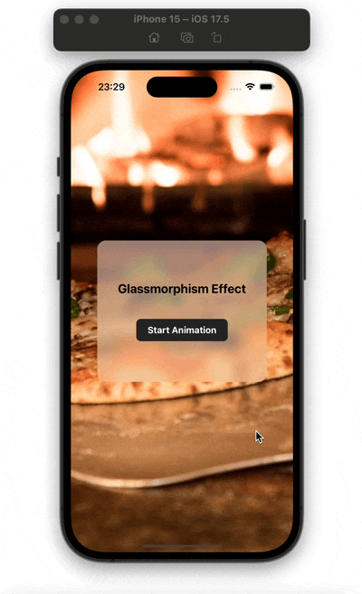

# 📱React Native Glassmorphism



The is the code for the tutorial in the article [📱React Native Glassmorphism](https://mikael-ainalem.medium.com/react-native-glassmorphism-effect-deeb9951469c)

# How to install and run it

```bash
# iOS
yarn && npx pod-install && yarn ios

# or Android
yarn && yarn android
```
